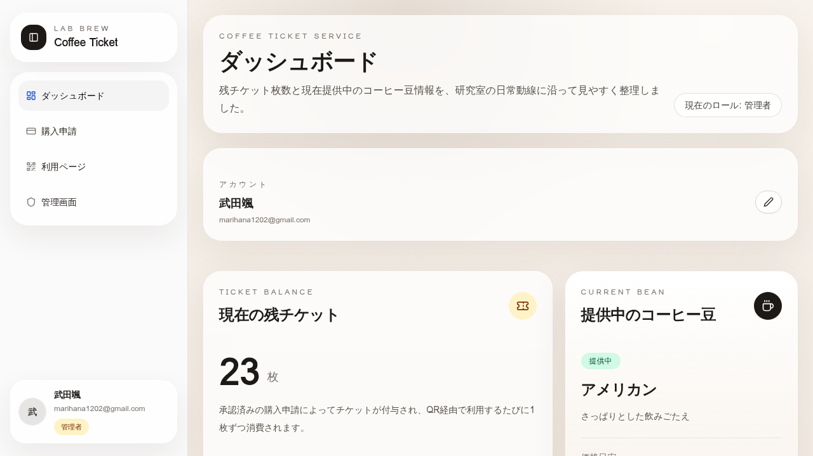

# Lab Brew Coffee Ticket Service

**研究室用コーヒー豆チケット管理アプリケーション**

---

## 📋 プロジェクト概要

Lab Brew Coffee Ticket Serviceは、研究室内のコーヒー豆の利用を効率的に管理するためのWebアプリケーションです。ユーザーはチケット制度を通じてコーヒー豆を利用でき、管理者は豆の在庫管理、ユーザーのチケット付与、利用ログの監視を一元的に行うことができます。

**主な特徴：**

- **Manus OAuthによる認証** - セキュアなログイン機構
- **ロールベースアクセス制御** - 一般ユーザーと管理者の権限分離
- **チケット制度** - 購入申請・承認・利用の完全なライフサイクル管理
- **QRコード利用** - 専用URLでワンクリック利用
- **リアルタイム統計** - 利用状況の可視化
- **詳細な監査ログ** - すべての操作を記録

---

## 📸 画面イメージ

### ダッシュボード



ダッシュボードでは、ユーザーが現在の残チケット枚数と提供中のコーヒー豆情報を一目で確認できます。左側のサイドバーからダッシュボード、購入申請、利用ページ、管理画面へのナビゲーションが可能です。

---

## 🎯 主要機能

### ユーザー機能

| 機能 | 説明 |
|------|------|
| **ダッシュボード** | 残チケット枚数、提供中のコーヒー豆情報を表示 |
| **チケット購入申請** | 10回/500円、25回/1000円のプランから選択。PayPay・現金の支払い方法に対応 |
| **QRコード利用** | 専用URLでチケットを1枚消費 |
| **アカウント管理** | プロフィール編集、アカウント名変更 |
| **利用者一覧表示** | 全ユーザーの利用状況を閲覧 |

### 管理者機能

| 機能 | 説明 |
|------|------|
| **購入申請管理** | 申請一覧の確認、手動承認によるチケット付与 |
| **豆情報管理** | コーヒー豆の登録・更新・削除 |
| **ユーザー管理** | ユーザー一覧、権限付与、チケット枚数編集 |
| **利用ログ監視** | 全ユーザーの利用履歴を確認 |
| **統計情報** | 累計利用回数、付与チケット数、利用回数ランキング |
| **テストアカウント管理** | テスト用アカウントの自動生成・削除 |
| **QRコード管理** | QRコード画像の生成・ダウンロード |

---

## 🏗️ システムアーキテクチャ

```
┌─────────────────────────────────────────────────────────────┐
│                     クライアント層                            │
│  React 19 + Tailwind CSS 4 + shadcn/ui                      │
│  ├─ ダッシュボード                                           │
│  ├─ 購入申請フォーム                                         │
│  ├─ 管理画面（複数タブ）                                     │
│  └─ ユーザープロフィール                                     │
└────────────────────┬────────────────────────────────────────┘
                     │ tRPC（型安全なRPC）
┌────────────────────▼────────────────────────────────────────┐
│                  サーバー層                                   │
│  Express 4 + tRPC 11                                         │
│  ├─ 認証エンドポイント（OAuth）                              │
│  ├─ チケット管理API                                         │
│  ├─ ユーザー管理API                                         │
│  ├─ 豆情報管理API                                           │
│  ├─ 統計API                                                 │
│  └─ QRコード生成API                                         │
└────────────────────┬────────────────────────────────────────┘
                     │
┌────────────────────▼────────────────────────────────────────┐
│                 データベース層                                │
│  MySQL/TiDB + Drizzle ORM                                    │
│  ├─ users テーブル                                           │
│  ├─ coffeeTickets テーブル                                   │
│  ├─ ticketTransactions テーブル                              │
│  ├─ purchaseRequests テーブル                                │
│  ├─ usageLogs テーブル                                       │
│  └─ qrCodes テーブル                                         │
└─────────────────────────────────────────────────────────────┘
```

---

## 📊 データベーススキーマ

### users テーブル

| カラム | 型 | 説明 |
|--------|-----|------|
| id | INTEGER | ユーザーID（主キー） |
| email | VARCHAR | メールアドレス（ユニーク） |
| name | VARCHAR | ログイン時の名前 |
| displayName | VARCHAR | ユーザーが設定したアカウント名 |
| role | ENUM | ユーザー権限（'user' \| 'admin'） |
| createdAt | TIMESTAMP | 作成日時 |
| updatedAt | TIMESTAMP | 更新日時 |

### coffeeTickets テーブル

| カラム | 型 | 説明 |
|--------|-----|------|
| id | INTEGER | チケットID（主キー） |
| userId | INTEGER | ユーザーID（外キー） |
| balance | INTEGER | 残チケット枚数 |
| totalGranted | INTEGER | 累計付与枚数 |
| totalConsumed | INTEGER | 累計利用枚数 |
| updatedAt | TIMESTAMP | 更新日時 |

### ticketTransactions テーブル

| カラム | 型 | 説明 |
|--------|-----|------|
| id | INTEGER | トランザクションID（主キー） |
| userId | INTEGER | ユーザーID（外キー） |
| amount | INTEGER | 変動枚数 |
| sourceType | ENUM | 変動理由（'purchase' \| 'consumption' \| 'admin_adjustment'） |
| description | VARCHAR | 説明 |
| createdAt | TIMESTAMP | 作成日時 |

### purchaseRequests テーブル

| カラム | 型 | 説明 |
|--------|-----|------|
| id | INTEGER | 申請ID（主キー） |
| userId | INTEGER | ユーザーID（外キー） |
| ticketCount | INTEGER | 申請チケット枚数 |
| priceYen | INTEGER | 金額（円） |
| paymentMethod | ENUM | 支払い方法（'paypay' \| 'cash'） |
| status | ENUM | ステータス（'pending' \| 'approved' \| 'rejected'） |
| createdAt | TIMESTAMP | 申請日時 |
| approvedAt | TIMESTAMP | 承認日時 |
| approvedBy | INTEGER | 承認者ID（外キー） |

### usageLogs テーブル

| カラム | 型 | 説明 |
|--------|-----|------|
| id | INTEGER | ログID（主キー） |
| userId | INTEGER | ユーザーID（外キー） |
| coffeeId | INTEGER | コーヒー豆ID（外キー） |
| action | ENUM | アクション（'consume' \| 'grant' \| 'admin_adjust'） |
| details | JSON | 詳細情報 |
| createdAt | TIMESTAMP | 作成日時 |

### coffeeBeansInfo テーブル

| カラム | 型 | 説明 |
|--------|-----|------|
| id | INTEGER | 豆ID（主キー） |
| name | VARCHAR | 豆の名前 |
| features | TEXT | 豆の特徴・説明 |
| priceYen | INTEGER | 価格（円） |
| isActive | BOOLEAN | 提供中フラグ |
| createdAt | TIMESTAMP | 作成日時 |
| updatedAt | TIMESTAMP | 更新日時 |

### qrCodes テーブル

| カラム | 型 | 説明 |
|--------|-----|------|
| id | INTEGER | QRコードID（主キー） |
| code | VARCHAR | QRコード文字列（ユニーク） |
| accessUrl | VARCHAR | アクセスURL |
| isActive | BOOLEAN | 有効フラグ |
| createdAt | TIMESTAMP | 作成日時 |

---

## 🔌 API仕様

### 認証エンドポイント

#### ログイン
```
GET /api/oauth/callback?code=...&state=...
```
Manus OAuthコールバック処理。ユーザーを認証し、セッションクッキーを発行します。

#### ログアウト
```
POST /trpc/auth.logout
```
セッションを終了し、ユーザーをログアウトします。

#### 現在のユーザー情報取得
```
GET /trpc/auth.me
```
現在ログインしているユーザーの情報を返します。

**レスポンス例：**
```json
{
  "id": 1,
  "email": "user@example.com",
  "displayName": "太郎",
  "role": "user"
}
```

---

### チケット管理エンドポイント

#### ダッシュボード情報取得
```
GET /trpc/ticket.dashboard
```
ユーザーのダッシュボード情報を取得します。

**レスポンス例：**
```json
{
  "remainingTickets": 23,
  "currentBean": {
    "id": 1,
    "name": "アメリカン",
    "features": "さっぱりした飲み口"
  }
}
```

#### QRコード経由でチケット消費
```
POST /trpc/ticket.consumeTicketViaQr
入力: { qrCode: "abc123xyz" }
```
QRコードを使用してチケットを1枚消費します。

---

### 購入申請エンドポイント

#### 購入申請作成
```
POST /trpc/ticket.createPurchaseRequest
入力: {
  ticketCount: 10,
  priceYen: 500,
  paymentMethod: "paypay"
}
```
新しいチケット購入申請を作成します。

#### 申請一覧取得（管理者のみ）
```
GET /trpc/admin.listPendingPurchaseRequests
```
未承認の購入申請一覧を取得します。

#### 申請承認（管理者のみ）
```
POST /trpc/admin.approvePurchaseRequest
入力: { requestId: 1 }
```
購入申請を承認し、チケットを付与します。

---

### ユーザー管理エンドポイント

#### ユーザー一覧取得
```
GET /trpc/admin.getUserUsageStats
```
全ユーザーの利用統計を取得します。

**レスポンス例：**
```json
[
  {
    "userId": 1,
    "userName": "user1",
    "displayName": "太郎",
    "totalConsumptions": 45,
    "totalTicketsPurchased": 50,
    "currentBalance": 5,
    "role": "user"
  }
]
```

#### ユーザー権限更新（管理者のみ）
```
POST /trpc/admin.updateUserRole
入力: {
  userId: 2,
  role: "admin"
}
```
ユーザーの権限を更新します。

#### チケット枚数編集（管理者のみ）
```
POST /trpc/admin.updateTicketBalance
入力: {
  userId: 1,
  newBalance: 30
}
```
ユーザーのチケット枚数を直接編集します。

---

### 豆情報管理エンドポイント

#### 豆一覧取得
```
GET /trpc/admin.listCoffeeBeans
```
登録されているコーヒー豆の一覧を取得します。

#### 豆情報登録（管理者のみ）
```
POST /trpc/admin.createCoffeeBean
入力: {
  name: "コロンビア",
  features: "バランスの取れた味わい",
  priceYen: 800,
  isActive: true
}
```
新しいコーヒー豆情報を登録します。

#### 豆情報更新（管理者のみ）
```
POST /trpc/admin.updateCoffeeBean
入力: {
  id: 1,
  name: "コロンビア",
  features: "バランスの取れた味わい",
  priceYen: 800,
  isActive: true
}
```
コーヒー豆情報を更新します。

#### 豆情報削除（管理者のみ）
```
POST /trpc/admin.deleteCoffeeBean
入力: { id: 1 }
```
コーヒー豆情報を削除します。

---

### 統計エンドポイント

#### 統計情報取得
```
GET /trpc/stats.summary
```
全体の統計情報を取得します。

**レスポンス例：**
```json
{
  "totalConsumptions": 1250,
  "totalGrantedTickets": 5000,
  "totalPendingRequests": 3,
  "activeBean": {
    "id": 1,
    "name": "アメリカン"
  }
}
```

---

## 🚀 セットアップ・使用方法

### 前提条件

- Node.js 22.13.0以上
- npm または pnpm
- MySQL 8.0以上（またはTiDB）
- Manus OAuthアカウント

### インストール

1. **リポジトリをクローン**
```bash
git clone <repository-url>
cd lab-coffee-ticket-app
```

2. **依存パッケージをインストール**
```bash
pnpm install
```

3. **環境変数を設定**
```bash
# .env ファイルを作成（テンプレートは .env.example を参照）
cp .env.example .env
```

4. **データベースをセットアップ**
```bash
# マイグレーションを実行
pnpm drizzle-kit generate
pnpm drizzle-kit migrate
```

5. **開発サーバーを起動**
```bash
pnpm dev
```

ブラウザで `http://localhost:3000` にアクセスしてください。

### テストアカウント

テストアカウント管理画面から自動生成できます。

**デフォルトテストアカウント：**

| 種類 | メール | パスワード |
|------|--------|-----------|
| 管理者 | test-admin@lab-coffee.local | 1111 |
| 一般ユーザー | test-user@lab-coffee.local | 1234567890@abc |

---

## 🔄 開発フロー・GitHub自動化

このプロジェクトではGitHubのIssue・ブランチ・PRを活用した開発フローを採用しています。

### ワークフロー

1. **Issue作成** - 新しい機能やバグ修正をIssueとして定義
2. **ブランチ作成** - `feature/issue-XXX-機能名` 形式でブランチを作成
3. **実装・テスト** - ブランチ上で実装を進め、テストを追加
4. **PR作成** - 実装完了時に自動的にPRが作成されます
5. **レビュー・マージ** - PRレビュー後にmainブランチにマージ

### 自動化スクリプト

本プロジェクトではGitHub自動化スクリプトを提供しています。以下の処理を自動化しています：

- **Issue自動作成** - 新機能の要件をIssueとして登録
- **ブランチ自動作成** - Issue番号を含むブランチを自動生成
- **PR自動作成** - 実装完了時のPRを自動作成

#### 使用方法

完全なワークフロー（Issue作成→ブランチ作成）：

```bash
./scripts/github-automation.sh workflow "機能名" "詳細な説明" "label"
```

個別コマンド：

```bash
# Issue作成
./scripts/github-automation.sh issue "機能名" "詳細な説明"

# ブランチ作成
./scripts/github-automation.sh branch <issue_number> "機能名"

# PR作成
./scripts/github-automation.sh pr "branch_name" <issue_number>
```

詳細な使用方法は [docs/GITHUB_WORKFLOW.md](./docs/GITHUB_WORKFLOW.md) を参照してください。

---

## 🧪 テスト

### ユニットテスト実行

```bash
pnpm test
```

### テストカバレッジ確認

```bash
pnpm test:coverage
```

### 主要テスト対象

- 認証・権限制御
- チケット管理ロジック
- 購入申請フロー
- ユーザー管理機能
- 統計計算

---

## 📁 ファイル構成

```
lab-coffee-ticket-app/
├── client/                    # フロントエンド（React）
│   ├── src/
│   │   ├── pages/            # ページコンポーネント
│   │   ├── components/       # 再利用可能なコンポーネント
│   │   ├── lib/              # ユーティリティ関数
│   │   ├── App.tsx           # ルーティング定義
│   │   └── index.css         # グローバルスタイル
│   └── public/               # 静的ファイル
├── server/                    # バックエンド（Express + tRPC）
│   ├── routers.ts            # tRCPエンドポイント定義
│   ├── db.ts                 # データベースクエリ
│   ├── auth.logout.test.ts   # テストファイル
│   └── _core/                # 内部フレームワーク
├── drizzle/                   # データベーススキーマ
│   └── schema.ts             # テーブル定義
├── shared/                    # 共有定数・型
├── package.json              # 依存パッケージ定義
└── README.md                 # このファイル
```

---

## 🔐 セキュリティ

### 認証・認可

- **Manus OAuth** - セキュアなシングルサインオン
- **セッションクッキー** - JWT署名付きセッション管理
- **ロールベースアクセス制御** - 管理者・一般ユーザーの権限分離

### データ保護

- **パスワードハッシュ化** - bcryptによるセキュアハッシュ
- **HTTPS通信** - 本番環境では必須
- **SQLインジェクション対策** - Drizzle ORMによる安全なクエリ

---

## 🐛 トラブルシューティング

### ログイン画面が表示されない

**原因：** OAuth設定が正しくない可能性があります。

**対応：**
```bash
# 環境変数を確認
echo $VITE_APP_ID
echo $OAUTH_SERVER_URL
```

### チケット消費がエラーになる

**原因：** QRコードが無効または期限切れの可能性があります。

**対応：** 管理画面のQRコード管理から新しいコードを生成してください。

### データベース接続エラー

**原因：** DATABASE_URLが正しく設定されていない可能性があります。

**対応：**
```bash
# 接続文字列を確認
mysql -u <user> -p -h <host> -D <database>
```

---

## 📞 サポート・問い合わせ

問題が発生した場合は、GitHubのIssueを作成してください。詳細なエラーメッセージとログを含めていただくと、対応が迅速になります。

---

## 📄 ライセンス

このプロジェクトはMIT Licenseの下で公開されています。

---

## 👥 貢献者

- **Manus AI** - 開発・実装

---

**最終更新日：** 2026年4月14日

**バージョン：** 1.0.0
